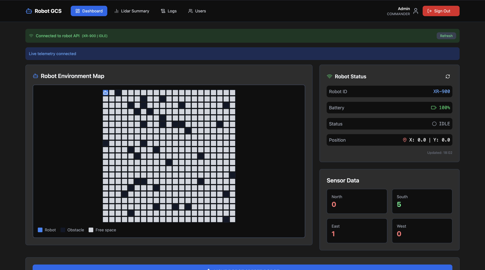
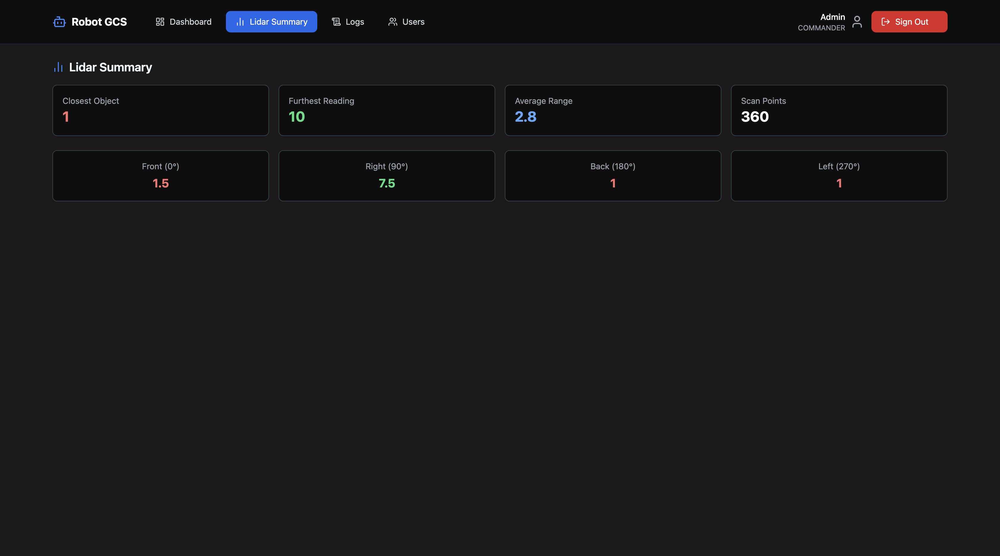
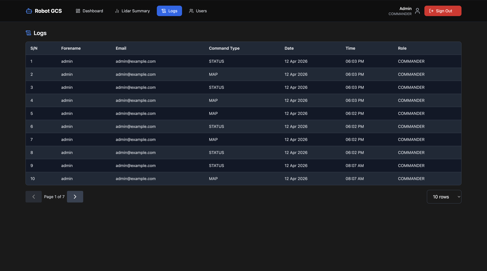
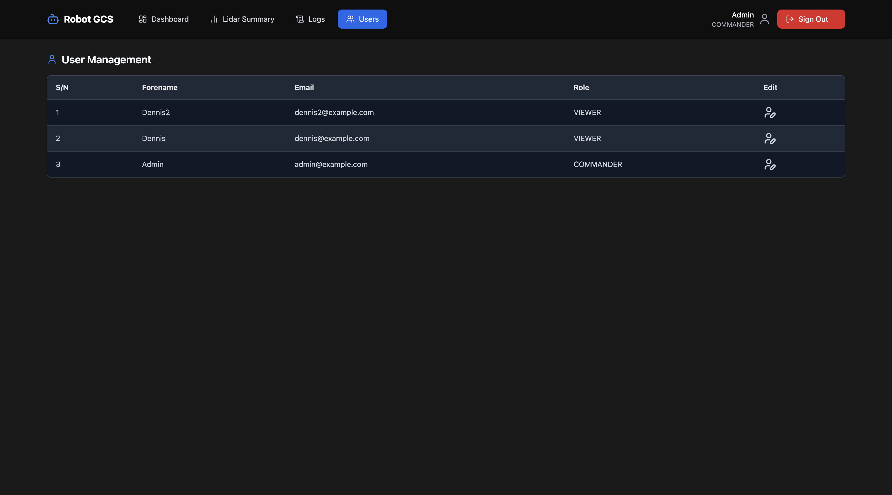

# 🚀 Ground Control Station (GCS)


A web-based **Ground Control Station** for monitoring and controlling a virtual robot through a REST API.

Built as part of a software engineering project, this system focuses on real-time robot interaction, system monitoring, and audit logging.

---

## 📸 Screenshots

### Dashboard

Displays real-time robot status including battery level, position, and movement state, along with controls to move and reset the robot.



---

### LiDAR Summary

Provides a summary of LiDAR scan data, including closest and farthest objects, average distance, and directional readings.



---

### Logs

Shows a paginated list of mission logs, including user actions, command types, timestamps, and success or failure status.



---

### Users

Lists all registered users with their roles, and allows role updates between Commander and Viewer.



---

## 📖 Overview

The Ground Control Station allows users to interact with a virtual robot in real time.

Users can:

- monitor robot status
- send movement commands
- reset the robot
- view environment maps
- inspect sensor readings
- review mission logs

The system is split into:

- **Frontend** → dashboard and UI
- **Backend** → authentication, logging, API integration
- **Robot Simulator** → provides robot data

---

## ✨ Features

- 🔐 Authentication (Sign up, Sign in, Sign out)
- 👥 Role-based access (**Commander / Viewer**)
- 🤖 Robot control system
- 📊 Live robot status display
- 🗺️ Map visualisation
- 📡 Sensor data display
- 📈 LiDAR scan summary
- 🧾 Mission audit logs (with pagination)
- ⚙️ User role management
- 📱 Responsive UI

---

## 🧰 Tech Stack

### Frontend

- React
- TypeScript
- Tailwind CSS
- Axios
- React Router DOM
- Lucide Icons

### Backend

- Node.js
- Express
- MongoDB
- Mongoose
- JWT Authentication
- bcryptjs
- node-fetch

---

## 🏗️ Architecture

```
Frontend (React)
        ↓
Backend (Express API)
        ↓
Robot Simulator API
        ↓
MongoDB (Logs + Users)
```

---

## ⚙️ Core Functionalities

### 🔐 Authentication

- Email + password login
- JWT-based authentication
- Stored in localStorage

### 👤 Role Management

- **COMMANDER** → full control
- **VIEWER** → limited access

### 🤖 Robot Control

- Move robot
- Reset robot
- Fetch live status
- View map and sensors

### 🧾 Mission Logging

Every action logs:

- timestamp
- user
- action
- payload
- success/failure

---

## 🔌 Robot API Endpoints

```
GET    /api/status
POST   /api/move
POST   /api/reset
GET    /api/map
GET    /api/sensor
WS     /ws/telemetry
```

---

## 📁 Project Structure

### Frontend

```
src/
  components/
  pages/
  services/
  utils/
  App.tsx
```

### Backend

```
backend/
  models/
  routes/
  utils/
  app.js
  RobotAPI.js
  RobotFacade.js
```

---

## ⚡ Getting Started

### 1. Clone repo

```bash
git clone https://github.com/Okoyedennis/CMP9134-final-project
cd CMP9134-final-project
```

---

### 2. Prerequisites

Make sure you have the following installed:

Docker Desktop
Git

---

### 3. Docker setup

This project runs using Docker Compose and includes:

Frontend container
Backend container
Virtual Robot Simulator container

The backend connects to:

MongoDB Atlas for database storage
Robot Simulator through Docker networking

---

### 4. Environment configuration

The required environment values are already defined in docker-compose.yml.

Backend environment includes:

PORT=3000
MONGO_URI=your_mongodb_connection_string
JWT_SECRET=your_jwt_secret
ROBOT_API_BASE_URL=http://robot-api:5000

Frontend environment includes:

VITE_API_BASE_URL=http://localhost:3000
VITE_TELEMETRY_WS_URL=ws://localhost:5001

---

### 5. Run the application with Docker

Build and start all services:

docker compose up --build

To run in detached mode:

docker compose up --build -d

To stop the services:

docker compose down

---

### 6. Application URLs

Once the containers are running, the application will be available at:

Frontend: http://localhost:2000
Backend: http://localhost:3000
Robot API Docs: http://localhost:5001/docs

### 7. Notes on Docker networking

The backend connects to the robot simulator using the Docker service name:

http://robot-api:5000

The browser/frontend connects to the robot simulator WebSocket using the host-mapped port:

ws://localhost:5001/ws/telemetry

## 📡 API Routes

### Auth

- POST `/auth/signup`
- POST `/auth/signin`
- POST `/auth/signout`

### Robot

- GET `/status`
- POST `/move`
- POST `/reset`
- GET `/map`
- GET `/sensor`

### Users

- GET `/users`
- PATCH `/users/:id/role`

### Logs

- GET `/logs?page=1&limit=10`

---

## 🖥️ Pages

- Sign In
- Sign Up
- Dashboard
- LiDAR Summary
- Logs
- Users

---

## 🎯 UI Design

- Clean control-room layout
- Status cards
- Role indicator
- Striped tables
- Notifications and loaders

---

## 👨‍💻 Author

**Dennis Okoye**
Computer Science — University of Lincoln

---

## 📜 License

Academic use only.
